# OTA Haier F17A1H / Andromax Prime Injector Tool
Tool ini berguna bagi pengguna Haier F17A1H (Andromax Prime) yang mau di update OTA secara offline atau ingin di root dengan metode injeksi ADB.

**Disclaimer**:
  *  Tool ini sebenarnya bukan baru, melainkan perbaikan dan penambahan dari tool-tool sebelumnya yang dibuat oleh para opreker ponsel Andromax Prime (**AdiRoot** dan **Ahka**). Jadi saya meneruskan perbaikan skrip saja yang lebih kompleks dari skrip perintah **AdiRoot** atau **Ahka**, dan setiap update ini ada versi-versi yang saya rilis itu sudah stabil atau terdapat bug, mohon dimaklumi.
  *  Saya senang kalau kalian yang berkunjung di sini untuk memberikan sebuah kritik dan masukan soal bug ini agar saya dapat memperbaiki di update selanjutnya.

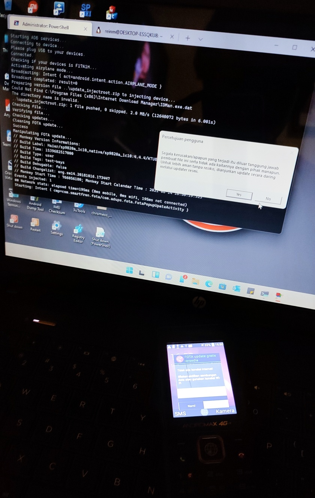  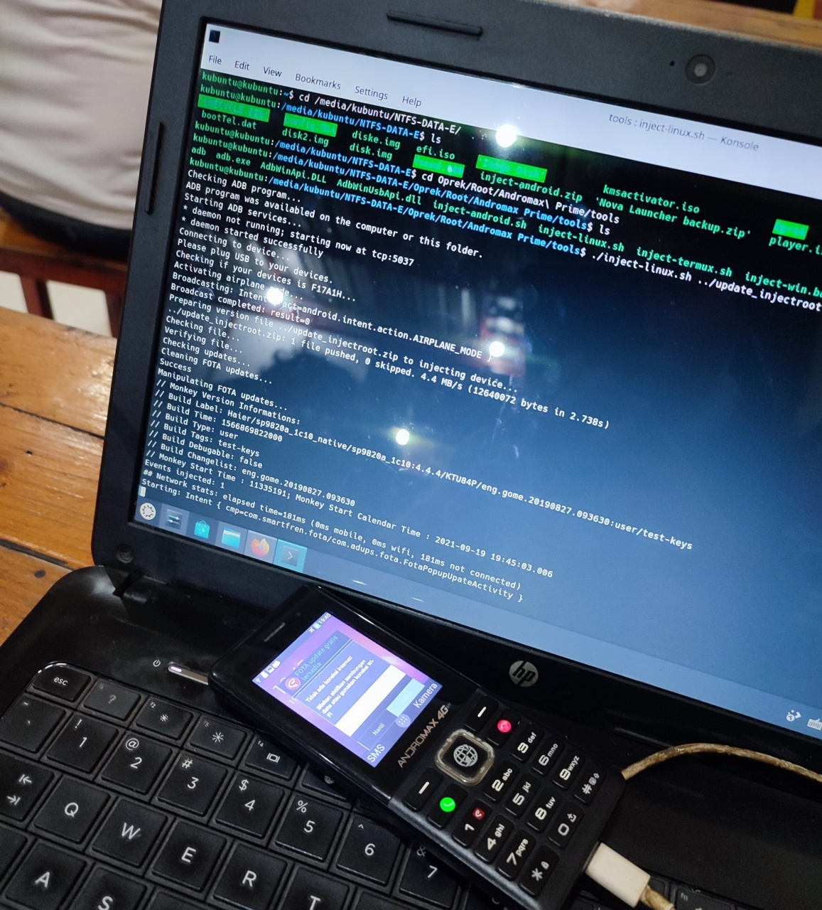  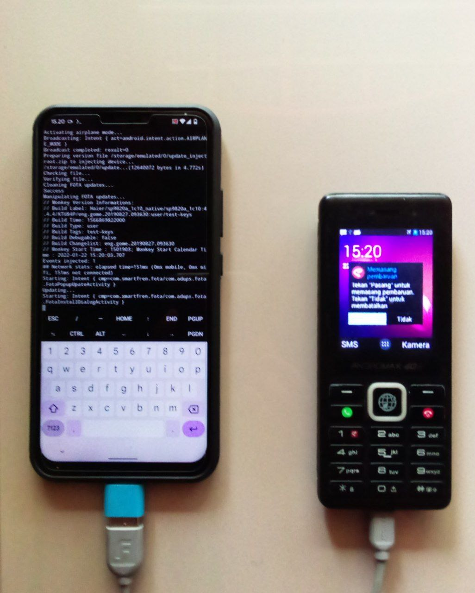

## Download:
Dibawah ini merupakan versi paling baru setiap saya mengupload. Silakan pilih sesuai dengan platform kalian masing-masing:

  1.  [Android Platform](https://github.com/thefirefox12537/ota_f17a1h_injector/releases/latest/download/inject-android.sh)
  1.  [Linux Platform](https://github.com/thefirefox12537/ota_f17a1h_injector/releases/latest/download/inject-linux.sh)
  1.  [Windows Platform](https://github.com/thefirefox12537/ota_f17a1h_injector/releases/latest/download/inject-win.bat)

Untuk mendownload skrip ataupun module di versi terdahulu, silakan cek di [sini](https://github.com/thefirefox12537/ota_f17a1h_injector/releases)

Untuk melihat riwayat perubahan dalam setiap rilis ini, silakan klik [Changelog](https://github.com/thefirefox12537/ota_f17a1h_injector#changelog)

Apabila kalian ingin root Haier F17A1H (Andromax Prime), saya sudah sediakan file update_injectroot.zip dan support di segala versi firmware Haier Andromax Prime. Klik [disini](https://mega.nz/file/ZNMEERzA#Wz7Km4PcSx0v1fG6Knuw0S2SF8oQlN4pr02NswiIMy0).

**Disclaimer**:  File update_injectroot.zip mengambil dari tool AdiRoot yang dibuat oleh [Adi Subagja](https://www.facebook.com/adisubagja.mint).


## Yang dibutuhkan:
### Android
| Yang dibutuhkan     | Keterangan                                                                           |
|:-------------------:| ------------------------------------------------------------------------------------ |
| Versi               | Minimal: 5.0.0 Lollipop<br/>Rekomendasi: 9.0 Pie                                     |
| Kernel              | Linux versi 3.0                                                                      |
| Prosesor            | 64-bit ARM architecture                                                              |
| Magisk              | [Versi 19.00 keatas](https://github.com/topjohnwu/magisk/releases)                   |
| Modules             | [ADB and Fastboot for Android NDK](https://github.com/Magisk-Modules-Repo/adb-ndk)   |
| Misc.               | *  Terpasang Terminal Emulator atau Termux<br/>*  Mendukung USB OTG pada smartphone  |

### Linux
| Yang dibutuhkan     | Keterangan                                                                                                   |
|:-------------------:| ------------------------------------------------------------------------------------------------------------ |
| Distribusi          | *  Debian/Ubuntu<br/>*  RedHat Enterprise Linux/CentOS/Fedora<br/>*  Arch Linux<br/>*  OpenSUSE/SLES         |
| Kernel              | Linux versi 4.4                                                                                              |
| Prosesor            | 64-bit Intel/AMD architecture                                                                                |

### Windows
| Yang dibutuhkan     | Keterangan                                                                                                                                                                                                                                                                                       |
|:-------------------:| ------------------------------------------------------------------------------------------------------------------------------------------------------------------------------------------------------------------------------------------------------------------------------------------------ |
| Versi               | Minimal:  **Windows 7 Service Pack 1**<br/>Rekomendasi:  **Windows 10**                                                                                                                                                                                                                          |
| .NET Framework      | [Versi 4.5 keatas](https://www.microsoft.com/en-us/download/details.aspx?id=30653)                                                                                                                                                                                                               |
| PowerShell          | Minimal:  [Windows Management Framework versi 4.0](http://web.archive.org/web/20181213045712/https://www.microsoft.com/en-us/download/details.aspx?id=40855)<br/>Rekomendasi:  [Windows Management Framework versi 5.1](https://www.microsoft.com/en-us/download/details.aspx?id=54616)          |
| Misc.               | *  [PowerShell core](https://github.com/powershell/powershell/releases)<br/>*  [Universal C Runtime](https://support.microsoft.com/en-us/topic/update-for-universal-c-runtime-in-windows-c0514201-7fe6-95a3-b0a5-287930f3560c)                                                                   |


## Cara menggunakan?
### Anda perlu mengunduh skripnya [diatas](https://github.com/thefirefox12537/ota_f17a1h_injector#download) dan ikuti tatacaranya sesuai platform yang anda gunakan:

#### Android

Pastikan kalian sudah terpasang Magisk, module ini dan memiliki aplikasi Terminal Emulator atau Termux pada perangkat HP. Jika sudah, buka Terminal Emulator lalu ketik: `su`, kemudian jalankan dengan ketik:
```sh
inject.sh "<path file update.zip>"
```
Apabila kalian tidak mau pasang module, bisa kalian pilih **shell script file** di atas, file akan terdownload di folder *Download* pada HP kalian (baik di penyimpanan Internal atau Eksternal/kartu memori SD) atau kalau kalian download di komputer, salin ke HP kalian di folder *Internal > Download*. Kemudian buka Terminal Emulator atau Termux pada HP lalu masuk ke `su` dulu dan ketik:
```sh
/system/bin/sh /sdcard/Download/inject-android.sh "<path file update.zip>"
```

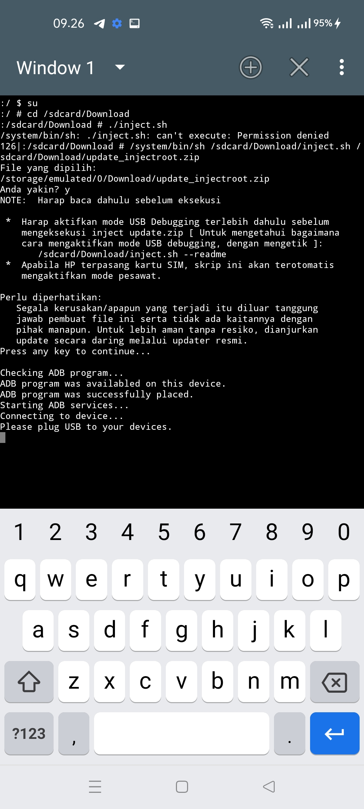  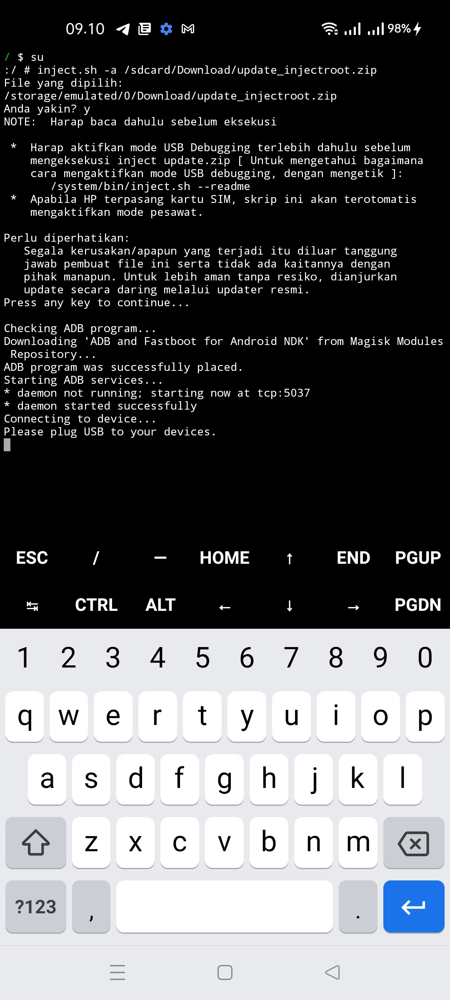

CATATAN PENTING:
  -  Penyimpanan internal `/sdcard`
  -  Penyimpanan eksternal `/storage/<ID serial kartu SD>`<br/>bisa kalian cek dengan perintah `su -c "ls /storage"` untuk mengetahui ID serial kartu SD kalian.

#### Linux

Buka terminal, lalu masuk ke direktori tempat skrip **inject-linux.sh** berada, jalankan dengan ketik:
```bash
./inject-linux.sh "<path file update.zip>"
```
Jika menemukan "Permission denied." ketik terlebih dahulu:
```bash
chmod 755 inject-linux.sh
```
lalu jalankan perintahnya beserta file update.zip nya.

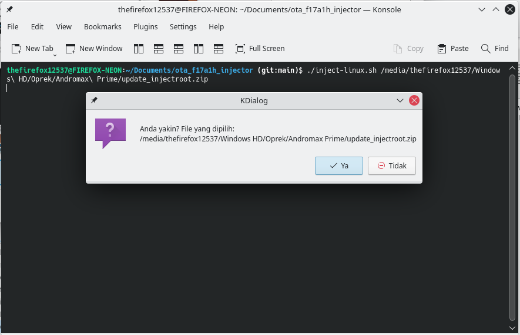

#### Windows

Buka Command Prompt atau PowerShell di menu Start. Lalu masuk ke direktori tempat skrip **inject-win.bat** berada, jalankan dengan ketik:
```cmd.exe
.\inject-win.bat "<path file update.zip>"
```

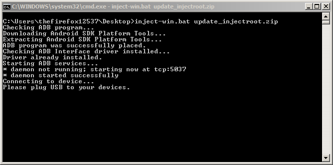

Apabila kalian masih awam dengan Command Prompt, kalian juga cukup bisa manfaatkan fungsi drag-'n-drop dengan file ZIP ke skrip **inject-win.bat** nya di Windows File Explorer.

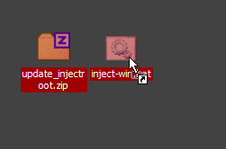  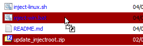


### Jika kalian tidak sempat mendownload skrip, kalian bisa salin perintah dibawah ini dan tempelkan ke Command Prompt/Terminal dan tambahkan/ketik nama file update.zip yang akan di inject:

#### Android (hanya bisa dijalankan di Termux)

Sebelum jalankan perintah ini, pasang wget dulu `pkg install wget tsu`, masuk `tsu`, kemudian:
```bash
bash <(wget -qO- https://bit.ly/injectroot-android) -Q
```

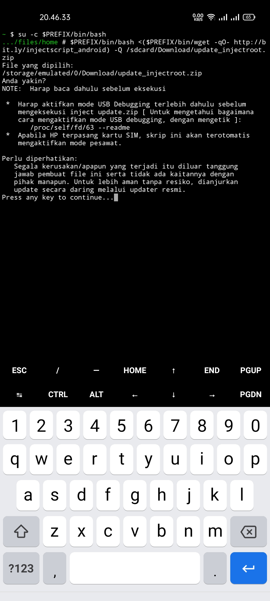

#### Linux
```bash
bash <(wget -qO- https://bit.ly/injectroot-linux) -Q
```

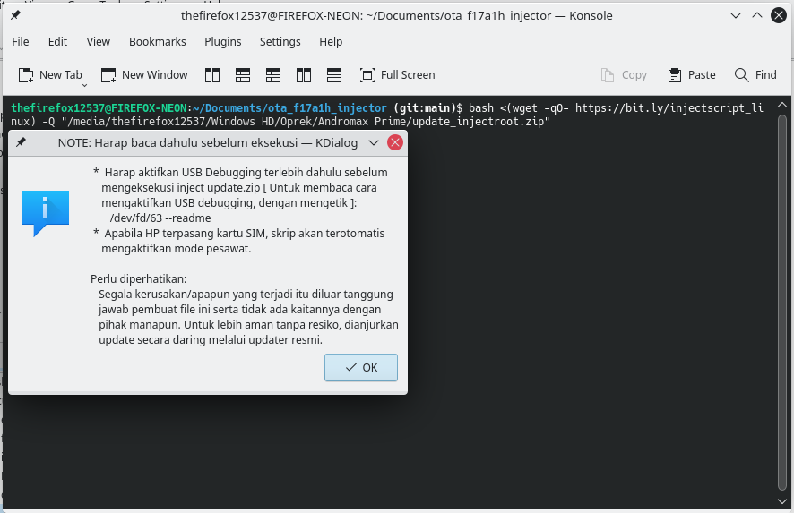

#### Windows (Command Prompt - Wajib terupdate Windows PowerShell versi 4.0 keatas)

Bila komputer anda berada di versi Windows 7 SP1
```cmd.exe
powershell -command ^
[Net.ServicePointManager]::SecurityProtocol = [Net.SecurityProtocolType]::Tls12 ;^
& ([Scriptblock]::Create((irm https://bit.ly/injectroot-windows))) -Q
```
Sedangkan di Windows 8 keatas
```cmd.exe
powershell -command ^& ([Scriptblock]::Create((irm https://bit.ly/injectroot-windows))) -Q
```
Apabila kalian sudah terpasang PowerShell core (Baik di Windows 7 atau Windows 8 keatas)
```cmd.exe
pwsh -command ^& ([Scriptblock]::Create((irm https://bit.ly/injectroot-windows))) -Q
```

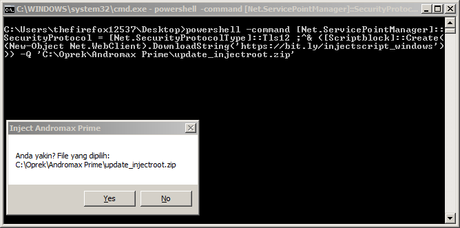

#### Windows (PowerShell versi 4.0 keatas)

Bila komputer anda berada di versi Windows 7 SP1
```powershell
[Net.ServicePointManager]::SecurityProtocol = [Net.SecurityProtocolType]::Tls12
& ([ScriptBlock]::Create((irm https://bit.ly/injectroot-windows))) -Q
```
Sedangkan di Windows 8 keatas atau menggunakan PowerShell core
```pwsh
& ([ScriptBlock]::Create((irm https://bit.ly/injectroot-windows))) -Q
```

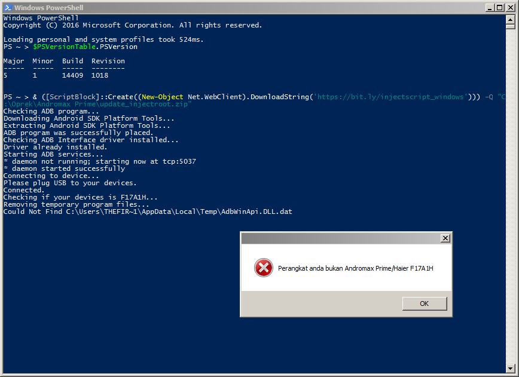


### Bila butuh panduan mengenai mengaktifkan mode USB debugging pada Haier F17A1H (Andromax Prime), bisa ketik sebagai berikut:

#### Android
```sh
inject.sh --readme
```
atau
```sh
/system/bin/sh /sdcard/Download/inject-android.sh --readme
```
atau
```bash
bash <(wget -qO- https://bit.ly/injectroot-android) --readme
```

#### Linux
```bash
./inject-linux.sh --readme
```
atau
```bash
bash inject-linux.sh --readme
```
atau
```bash
bash <(wget -qO- https://bit.ly/injectroot-linux) --readme
```

#### Windows
```cmd.exe
.\inject-win.bat --readme
```
atau
```cmd.exe
powershell -command ^
[Net.ServicePointManager]::SecurityProtocol = [Net.SecurityProtocolType]::Tls12 ;^
& ([ScriptBlock]::Create((irm https://bit.ly/injectroot-windows))) --readme
```
atau
```powershell
[Net.ServicePointManager]::SecurityProtocol = [Net.SecurityProtocolType]::Tls12
& ([ScriptBlock]::Create((irm https://bit.ly/injectroot-windows))) --readme
```
atau
```pwsh
& ([ScriptBlock]::Create((irm https://bit.ly/injectroot-windows))) --readme
```


## Kontak:
  -  [Facebook](https://fb.me/thefirefoxflasher)
  -  [Instagram](https://www.instagram.com/thefirefoxflasher_)
  -  [WhatsApp](https://bit.ly/wa_thefirefoxflasher)
  -  [E-mail](mailto:reinmclaren33@gmail.com)


## Changelog:
### v2.0.1
  1.  Pembaharuan minor
  1.  Log proses lebih dinamis pada proses pengunduhan dan cek perangkat (Linux, Android dan Windows)
  1.  Perbaikan kesalahan perintah argumen/parameter (Linux dan Android)
  1.  Perubahan kode dialog pesan (Windows)
  1.  Perbaikan Hybrid script yang lebih sempurna (Windows)
  1.  Kini kalian bisa menggunakan skrip ini dengan PowerShell core (versi 6.0 keatas) apabila kalian memilikinya **(Cek di [yang dibutuhkan](https://github.com/ota_f17a1h_injector#yang-dibutuhkan).)** (Windows)
### v2.0.0
  1.  Peloncatan ke versi baru
  1.  Perubahan jendela dialog pesan dari CScript/Windows Script Host ke dotNET Forms via PowerShell (Windows)
  1.  Perubahan total kode penggabungan skrip batch dan PowerShell jadi satu/Hybrid script (Windows)
  1.  Kini tidak mendapatkan pembaharuan module Magisk sudah saya stop, jadi kalian unduh skrip saja dan jalankan `sh <path folder>/inject-android.sh <perintah argumen/file update.zip>` (Android)
### v1.5.3
  1.  Pembaharuan minor ketiga
  1.  Tambahan baris skrip menjalankan langsung ke mode root tanpa ketik `su` atau `tsu` terlebih dahulu (Android)
  1.  Perubahan skrip dialog pesan (Windows)
### v1.5.2
  1.  Pembaharuan minor kedua
  1.  Perbaikan cek paket program Android SDK Platform Tools (Windows)
  1.  Tambahan baris skrip mematikan service ADB saat menemui kesalahan cek perangkat Android
### v1.5.1
  1.  Pembaharuan minor
  1.  Tambahan output untuk menerangkan bila perintah online berjalan
  1.  Tambahan baris skrip apabila komputer sudah terdapat paket program Android SDK Platform Tools (Linux dan Windows)
  1.  Perubahan pesan dialog (Linux)
### v1.5.0
  1.  Penambahan perintah baru **--download-adb** untuk mengunduh ADB dari repositori Magisk Modules 'ADB and Fastboot for Android NDK' secara permanen 'ditaruh ke /data/local/bin dan tidak dapat dieksekusikan dari luar skrip' (Android)
  1.  Perbaikan baris skrip di perintah online (Android)
  1.  Perbaikan cek versi Sistem Operasi (Windows)
  1.  Perbaikan perintah **--non-market**
### v1.4.4
  1.  Pembaharuan minor keempat
  1.  Perbaikan baris skrip
  1.  Perbaikan baris skrip di perintah online
  1.  Penambahan cek file sasaran (skrip akan bekerja kalau file ekstensinya zip atau flashable recovery/TWRP/OTA pada umumnya dalam dunia pengoprekan HP Android.)
  1.  Penambahan perintah install wget bila Termux shell belum terpasang (Android)
### v1.4.3
Pembaharuan minor ketiga
### v1.4.2
  1.  Pembaharuan minor kedua
  1.  Perbaikan baris skrip
  1.  Penambahan protokol keamanan jaringan (Windows)
  1.  Perubahan menjalankan skrip secara online **(Lihat di [README.md](https://github.com/thefirefox12537/ota_f17a1h_injector#jika-kalian-tidak-sempat-mendownload-skrip-kalian-bisa-salin-perintah-dibawah-ini-dan-tempelkan-ke-command-promptterminal-dan-tambahkanketik-nama-file-updatezip-yang-akan-di-inject).)**
### v1.4.1
Pembaharuan minor
### v1.4.0: Revision #1 (Tidak ada sertaan ke paket releases)
Penambahan skrip baru di platform Windows PowerShell **(Lihat di [README.md](https://github.com/thefirefox12537/ota_f17a1h_injector#jika-kalian-tidak-sempat-mendownload-skrip-kalian-bisa-salin-perintah-dibawah-ini-dan-tempelkan-ke-command-promptterminal-dan-tambahkanketik-nama-file-updatezip-yang-akan-di-inject).)**
### v1.4.0
  1.  Perubahan menjalankan skrip secara online **(Lihat README.md [bagian atas](https://github.com/thefirefox12537/ota_f17a1h_injector#jika-kalian-tidak-sempat-mendownload-skrip-kalian-bisa-salin-perintah-dibawah-ini-dan-tempelkan-ke-command-promptterminal-dan-tambahkanketik-nama-file-updatezip-yang-akan-di-inject), perintah wget. Sedang dikerjakan untuk update selanjutnya, untuk update saat ini masih dalam pengembangan jadi sedikit bug berjalannya perintah tersebut.)**
  1.  Kini di platform Android sudah dapat menjalankan secara online tanpa membutuhkan syarat memasang module ADB terlebih dahulu
  1.  Pesan dialog mengaktifkan mode pesawat dan resiko sudah disatukan pada bagian awal
### v1.3.0
  1.  Perbaikan pengunduhan program ADB (Windows)
  1.  Perbaikan pengunduhan dan pemasangan driver ADB (Windows)
  1.  Perubahan pesan dialog
  1.  Setelah proses inject, penambahan skrip tunggu perangkat hidup
  1.  Mendukung menjalankan skrip secara online **(Lihat README.md [bagian atas](https://github.com/thefirefox12537/ota_f17a1h_injector#jika-kalian-tidak-sempat-mendownload-skrip-kalian-bisa-salin-perintah-dibawah-ini-dan-tempelkan-ke-command-promptterminal-dan-tambahkanketik-nama-file-updatezip-yang-akan-di-inject), perintah wget. Sedang dikerjakan untuk update selanjutnya, untuk update saat ini masih dalam pengembangan jadi sedikit bug berjalannya perintah tersebut.)**
### v1.2.3
  1.  Pembaharuan minor ketiga
  1.  Perbaikan cek perangkat bahwa itu Andromax Prime
  1.  Penghapusan rilisan minor lama v1.2
### v1.2.2
  1.  Pembaharuan minor kedua
  1.  Perubahan batasan versi Android di module inject-android.zip
  1.  Perbaikan skrip bash/shell Linux
  1.  Perbaikan install otomatis driver ADB pada inject-win.bat
### v1.2.1
Pembaharuan minor
### v1.2
  1.  Menghapus batasan Visual C++ 2015 Redist pada inject-win.bat
  1.  Penambahan perintah --non-market untuk inject update_injectroot.zip (File root)
### v1.1.1
  1.  Pembaharuan minor
  1.  Menambahkan batasan versi kernel Linux, distro Linux dan sistem arsitektur prosesor pada inject-linux.sh
  1.  Penambahan UI dialog di inject-linux.sh (menggunakan KDialog jika berada dalam lingkungan KDE Plasma)
  1.  Menambahkan batasan versi Android, dan support USB Host OTG pada inject-android
  1.  Menambahkan batasan Visual C++ 2015 Redist pada inject-win.bat
  1.  Menambahkan fungsi instalasi driver ADB pada inject-win.bat
  1.  Perubahan fungsi pemeriksa perangkat bila perangkat itu Andromax Prime/Haier F17A1H
### v1.1
  1.  Menambahkan batasan versi Windows, PowerShell, dan dotnet Framework
  1.  Memperbaiki Download Manager pada inject-win.bat
  1.  Menambahkan fungsi mengaktifkan mode pesawat secara otomatis
### v1.0
Initial release
